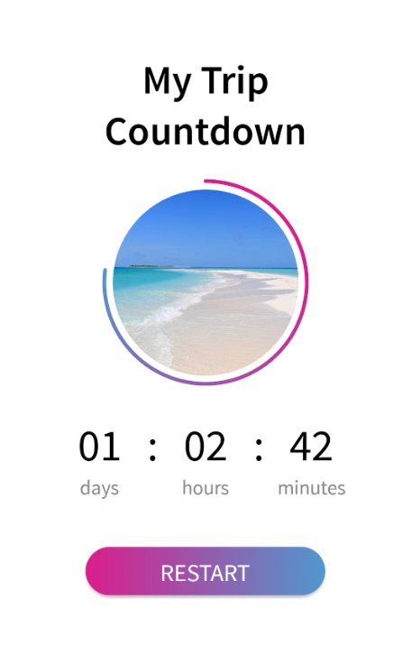

## About
This app is used to remind you hourly to do consecration. It's focussed on getting the user to do the consecration exactly on top of the hour.
## Credits

Consecration app is a fork and modification of My Trip Countdown is a Xamarin.Forms sample to show how to create **goodlooking UI** with Xamarin.Forms. This sample is based on [Countdown timer](https://dribbble.com/shots/3580838-Daily-UI-014-Countdown-timer/) designed by [Victoria Sgarro](https://dribbble.com/victoriasgarro).

## Xamarin.Forms App (Consecration App)

**Xamarin.Forms** allows you to build native UIs for iOS, Android, Windows, Linux, macOS and Tizen from a single, shared codebase. This project exercises the following patterns and features:

- XAML UI
- Animations
- Converters
- Custom Controls
- MVVM
- Plugins for Xamarin
- Styles
- SkiaSharp
- [.NET Standard 2.0](https://github.com/dotnet/standard)

## Supported Platforms: iOS and Android

My Trip Countdown app is available for two platforms:

- iOS
- Android

## Screens

## Requirements

* [Visual Studio 2017 version 15.3 or Visual Studio for Mac version 7.3](https://www.visualstudio.com/vs/)

## Licenses

This project uses some third-party assets with a license that requires attribution:

- Source Sans Pro
- [SkiaSharp](https://www.nuget.org/packages/SkiaSharp)
- [FFImageLoading](https://github.com/daniel-luberda/FFImageLoading)
- [Skor.Controls](https://github.com/skordesign/SKOR.UI)

## Copyright and license

Code released under the [MIT license](https://opensource.org/licenses/MIT).
